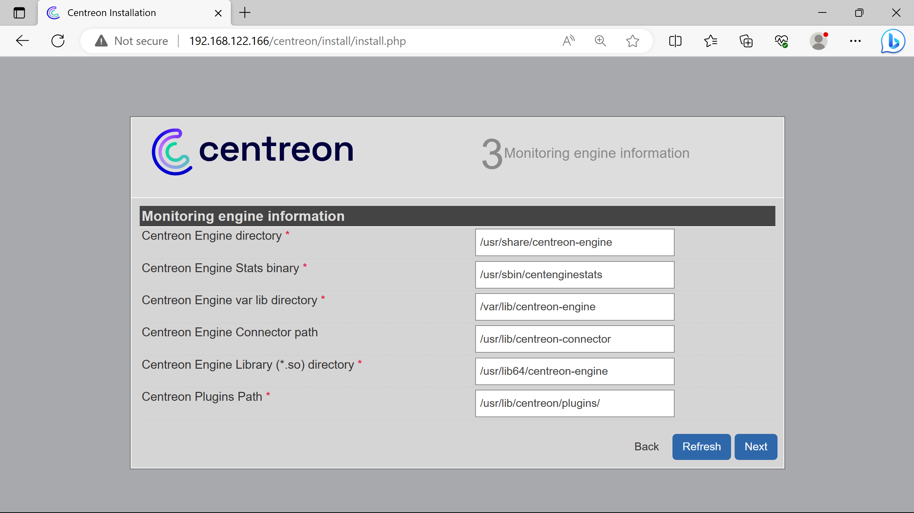
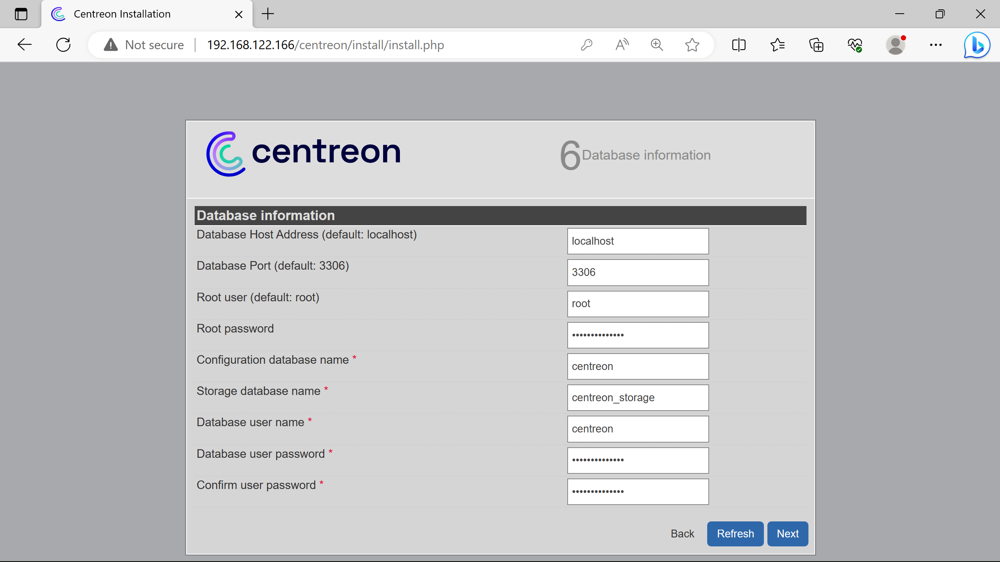
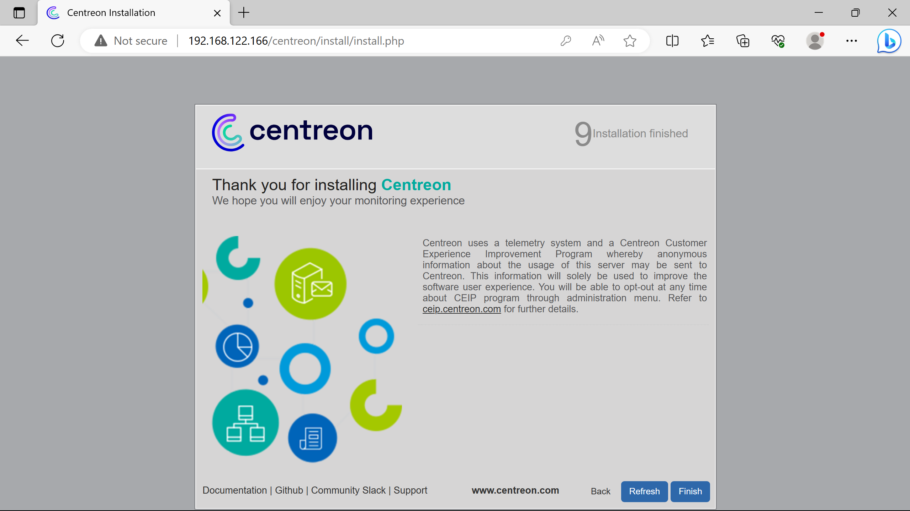
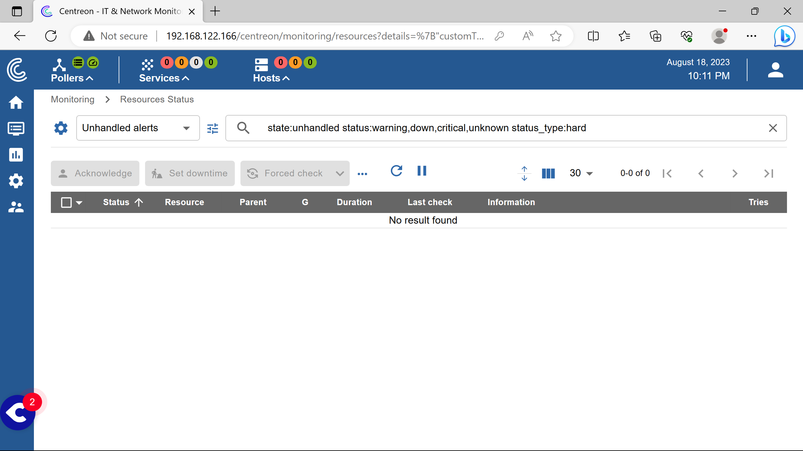

<!-- prologue -->


overviewing centreon it    
& getting fully hands-on


<!-- article -->

## introduction

The last article in this series will be devoted to discover & use Centreon IT.

Feel free to correct me by email if i've said something wrong.

### presentation

[Centreon IT](https://www.centreon.com) is a french open-source based monitoring solution.

It is highly [inspired by Nagios](https://www.centreon.com/centreon-and-nagios-3-milestones-to-understand-their-distinctiveness/), since it was a Nagios frontend at its beginning. 

Centreon's solutions has the same Nagios' plugins & hosts systems but can keep their hands on the plugins with their repository - where [the community can freely publish them for Nagios](https://www.xeylou.fr/posts/nagios-introduction/#fundamentals).

Centreon is a profit-oriented company who has a business model based on licensing the number of hosts monitored.

<!-- 

Quotation is based on the number of equipment devices being monitored. Prices start at 250 monitored devices, then 500, 1000, 2000… sky is the limit. Subscriptions include software licenses, access to our Support team by phone or by mail and unlimited software updates. And Managed Service Providers can benefit from a Pay-per-Use pricing model specifically designed to help them grow their business.

-->

The free solution called Centreon IT-100 is licensed for 100 monitored hosts only - their [Free Trial](https://www.centreon.com/free-trial/). Other differences with the commercial editions are listed in [their comparison table](https://www.centreon.com/centreon-editions/).

## namely

Informations on how Centreon IT works & its specific features.

### organisation

Centreon claims their solutions can be hosted on site, called `OnPrem`, or cloud-based, called `Cloud`.

Centreon instances always works with a Central Server, called `centreon-central` used to configure monitoring, display & operate the collected data.

To monitor multiple sites, instances can be deployed & attached to the Central Server, the `Remote Servers`.

Monitored data is gathered using `Pollers`, attached to the Central or a Remote Server.

Here is what a `Centreon OnPrem` distributed architecture should looks like according to Centreon.


%%{init: {'theme':'dark'}}%%
graph TD
central[Central Server]
remote0[Remote Server]
remote1[Remote Server]
remote2[Remote Server]
poller0((Poller))
poller1((Poller))
poller2((Poller))
poller3((Poller))
poller4((Poller))
poller5((Poller))

central --- remote0 & remote1 & remote2
remote0 --- poller0 & poller1
remote1 --- poller2 & poller3
remote2 --- poller4 & poller5


The `Centreon Cloud` architecture does away with Remote Servers, as Pollers are connected to the Central Server via the cloud - using a vpn.


%%{init: {'theme':'dark'}}%%
graph TD
central[Central Server]
poller0((Poller))
poller1((Poller))
poller2((Poller))

central --- poller0 & poller1 & poller2


### hosting 

[Centreon documentation](https://docs.centreon.com/) guides to host onprem & cloud solutions on different supports.

For an overview, they give `*.ovf` & `*.ova` images for virtual box & vmware respectively.

<!-- https://download.centreon.com/#Appliances/ -->
Installations alongside gnu/linux distros is preferable for production use.

<!-- https://docs.centreon.com/docs/installation/installation-of-a-central-server/using-packages/ -->
The documentation guides it for RHEL, Alma/Oracle/Rocky Linux since they are rhel based distros - *(or "were" since [rhel closed their source](https://www.redhat.com/en/blog/furthering-evolution-centos-stream))*.

Less attention is putted on Debian, the documentation is deprecated for it.

<!-- https://docs.centreon.com/docs/21.10/installation/installation-of-a-central-server/using-centreon-iso/ -->
<!-- https://download.centreon.com/#version-21-10/ -->
In the past - until ver. 21.10, they used to create `*.iso` images to install their solutions alongside centos.

### connectors & plugins

<!-- https://docs.centreon.com/cloud/monitoring/pluginpacks/ -->
Data collection performed by Centreon models called `Monitoring Connectors` which have `Plugins` assets.

Plugins have the same function as Nagios ones.

Installed & used by pollers, they are sets of commands to monitor various kinds of metrics, on differents type of hosts regarding many protocols.

Plugins & connectors are maintained in their [centreon-plugins](https://github.com/centreon/centreon-plugins) & [centreon-connectors](https://github.com/centreon/centreon-connectors) repositories, where it seems community can contribute.

<!-- https://docs.centreon.com/docs/21.10/monitoring/pluginpacks/ -->
<!-- https://docs.centreon.com/docs/administration/licenses/ -->
Although it's opensource, a license is required to access the full Plugin Pack on their solutions.

## deploying

Installing Centreon IT-100, doing a simple windows & linux hosts monitoring.

### requirements

The infrastructure size depends on the number of hosts to monitor.

Centreon recommends using lvm to manage their file systems - working fine without, but should be planned for production use.

A stand-alone central server is used under 500 hosts. Pollers every 500 hosts are expected with a database server if more than 2'500 hosts.

For production use, it would be a good idea to think about scalability.

Since there would be to many informations to display (partitionning, specs, infrastructure), i let you refer to their [infrastructure sizes charts](https://docs.centreon.com/docs/installation/prerequisites/#characteristics-of-the-servers).

### infrastructure

The same [infrastructure used in the nagios article](https://www.xeylou.fr/posts/nagios-introduction/#infrastructure) will be deployed.

Here is what the used infrastructure looks.


%%{init: {'theme':'dark'}}%%
graph TD

subgraph lan[LAN]
router{Router}
switch[Switch]
centreon(Centreon Central Server<br><font color="#a9a9a9">192.168.122.166</font>)
linux(Linux Host<br><font color="#a9a9a9">192.168.122.164</font>)
win(Windows Host<br><font color="#a9a9a9">192.168.122.36</font>)
apache(Apache Server)
end

wan{WAN}---router
router---switch
switch---centreon
switch---linux
switch---win
linux-.-apache



### installation

Centreon IT will be installed without license on Debian 11.

I made an installation script available on [Github](https://github.com/xeylou/centreon-it-overview/deb11-centreon-install.sh).

This script installs Centreon IT from Centreon's apt repositories & install a secured mysql server through mariadb.

To execute it, run the following commands.

```bash
mkdir testing && cd testing
wget https://github.com/xeylou/centreon-it-overview/deb11-centreon-install.sh
chmod +x debian-centreon-install.sh
./debian-centreon-install.sh
```

Installation can be resumed going on the Centreon web interface `https://192.168.122.166`.


More dependencies than the ones loaded here could be presented as `Not loaded` for debugging.




Creation of a admin account for the Centreon interface.



Connexion to the db server. The root password was asked by the script when installing.

Creation of a db user to perform data querries - not with the admin one.





Login created step `5Admin information`.



After the installation, the Central server poller is not working.

Additionnal steps are required to start monitoring.


Go to the poller section to see it.


Need to click on `Export configuration`.


Select the `Central` poller.


Check `Move Export File`.


Then `Export`.

After that, run the following commands, keep their order without modifying them.


```bash
systemctl restart cbd centengine
systemctl restart gorgoned
systemctl start snmptrapd centreontrapd
systemctl start snmpd
```

Then the poller starts working.


*(the red circle at top left, to the right of Pollers logo disappears later)*

### monitoring

Centreon recommends using their snmp implementation plugins to gather metrics - *cpu load, memory usage etc.*

On wanted monitored host, snmp should be configured and working.

<!-- 

prendre plugin pollers

systemctl restart cbd centengine centreon


apt install -y snmp
nano /etc/snmp/snmp.conf

-->
## close
<!-- https://thehackernews.com/2021/02/hackers-exploit-it-monitoring-tool.html
https://www.wired.com/story/sandworm-centreon-russia-hack/ 
nagios a une page sur ses cve connues, que je n'ai pas trouvé sur centreon https://www.nagios.com/products/security/
c'est dur de trouver un problème sur centreon car beaucoup trop de choses à gérer... -->