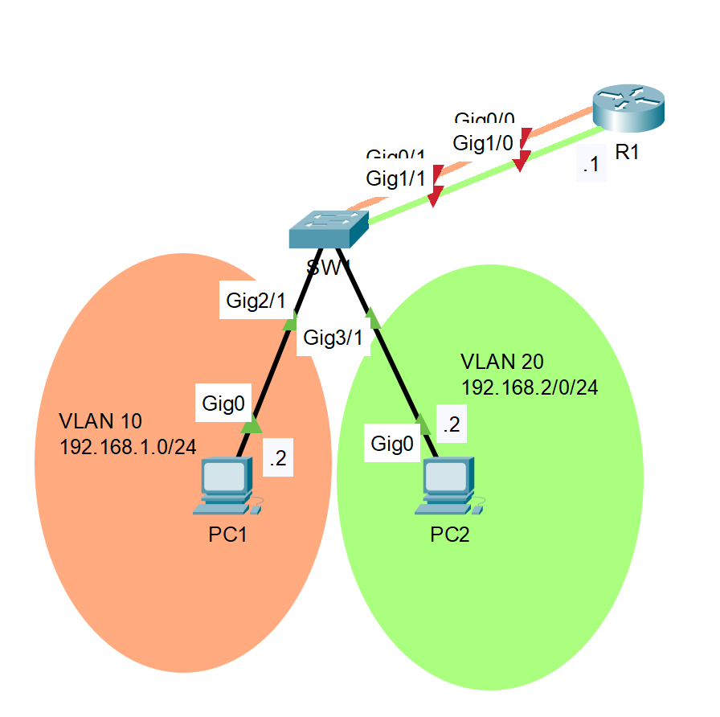

<!-- prologue -->


prise en main du routage  
inter-vlan sur équipements cisco


<!-- article -->

## introduction

je crée finalement une série d'articles dédiés à r301, le module abordant du cisco cli évalué en pratique

cet article est dédié à la compréhension & l'étude des principes liés au routage inter-vlan sur des équipements cisco, pas à de l'exploration technique ou une utilisation avancée

j'expose uniquement les bases du routage inter-vlan, libre à vous de chercher plus loin dans la pratique

*si vous avez intégré cet article, les tp devraient être triviaux*

## rappels vlan

<!-- les vlan *virtual lan* servent à faire de la ségmentation réseau sur la couche 2 du modèle osi -->

les vlan servent à faire de la ségmentation réseau

les machines d'un vlan ne pourront communiquer qu'avec les machines de ce même vlan (ségmentation)

<!-- ainsi, les vlans seuls permettent de séparer les différents réseaux présents sur un équipement -->

l'attribution des vlan à des équipements se fait généralement sur un switch

les ports d'un switch sont associés à des vlans, les machines derrière ces ports sont en conséquent affectées à des vlan sans qu'elles ne le sachent

de ce fait, les machines du vlan `X` auront accès uniquement aux autres machines du vlan `X`

*side note: tous les ports des switchs cisco ont un vlan par défaut & natif : le vlan 1, donc tout le monde se voit partout*

## principes d'inter-vlan

les vlans ségmentarisent les réseaux sur la couche 2 du modèle OSI

il n'est pas possible de les contourner en remontant les couches, ni en les descendant (aller sur le support...)

cependant, il est parfois nécessaire de faire communiquer des machines appartenant à des vlan différents

*e.g. dans un réseau d'entreprise avec un vlan `COMPTA` & un vlan `SECRETAIRES`, les deux auraient besoin d'accéder au vlan `SERVICES`*

une machine devrait donc se charger de faire passer les trâmes d'un vlan à un autre

le remède à tout ça serait un `routeur`, transférant les trames d'un vlan à un autre, plutôt que d'un réseau à un autre

cela existe & est disponible sur tous les routeurs cisco

leur spécificité étant qu'ils font du routage entre les vlan : du `routage inter-vlan`

## notions annexes

cette notion sera abordée pour la suite

un lien peut transporter plusieurs vlans, mais ces vlan ne se verront pas

il faut que les deux ports, les deux extrémités du lien, soient configurés de la même manière d'un bout à l'autre

c'est le principe d'un lien `trunk`

## méthodes d'inter-vlans

un routeur peut faire du routage inter-vlan de la même manière qu'il le fait pour des réseaux physiques


%%{init: {'theme':'dark'}}%%
graph TD
r1{R1}
sw1[SW1]
sw2[SW2]
pc1[PC1]
pc2[PC2]

r1 ---|vlan 10| sw1
r1 ---|vlan 20| sw2
sw1 ---|vlan 10| pc1
sw2 ---|vlan 20| pc2


cependant, selon les réseaux, un bien plus grand nombre de vlan peuvent être amené à être routé

l'idée de garder un lien par vlan devient alors insensée

l'utilisation de ports en mode trunk est alors recommandé, vu [notions annexes](#notions-annexes), pour transporter plusieurs vlan

le routage devenant alors `on stick`


%%{init: {'theme':'dark'}}%%
graph TD
r1{R1}
sw1[SW1]
pc1[PC1]
pc2[PC2]

r1 ---|trunk<br>vlan 10, 20<br>| sw1
sw1 ---|vlan 10| pc1
sw1 ---|vlan 20| pc2


<!-- exemples simples d'application des différentes [méthodes d'inter-vlan](#méthodes-inter-vlans) -->

<!-- https://www.ccnablog.com/inter-vlan-routing/#:~:text=Configuring%20inter-VLAN%20routing%20using%20router-on-a-stick%201%20Step%201.,4%20Step%204.%20...%205%20Step%205.%20 -->

## routage simple

comme dit [méthodes d'inter-vlan](#méthodes-dinter-vlans), le routage peut se faire en utilisant des liens physiques

cette méthode n'est pas utilisée car serait beaucoup trop chère (acheter un routeur physique 48 ports ça n'existe pas...)

je l'expose tout de même ici car demandé en td

les notions de routage restent les mêmes, les vlan ayant des adresses réseau différentes -> c'est comme des réseaux physiques

si l'on se base sur la topologie suivante




télécharger le fichier packet tracer vierge


voici les commandes de configurations des équipements présents

j'omets d'expliquer les commandes: elles devraient être transparentes -> mêmes que pour routage simple

configuration du switch SW1

```bash
enable
configure terminal
hotsname SW1
no ip domain-lookup
int g0/1
switchport access vlan 10
exit
int g1/1
switchport access vlan 20
exit
int g2/1
switchport access vlan 10
exit
int g3/1
switchport access vlan 20
exit
end
```

*les ports d'un switch sont UP par défaut, pas besoin de la commande `no shutdown`*

*pas besoin de la commande `switchport mode access`, les ports le sont par défaut*

configuration du routeur R1

```bash
enable
configure terminal
hotsname R1
no ip domain-lookup
int g0/0
ip address 192.168.1.1 255.255.255.0
no shut
exit
int g1/0
ip address 192.168.2.1 255.255.255.0
no shut
exit
end
```

après l'attribution d'une adresse ip à PC1 & PC2 selon l'adresse réseau de leur vlan + leur, & leur passerelle -> ils pourront se ping

## routage on stick

le routage inter-vlan on stick possède les mêmes propritétés que le [routage inter-vlan simple](#routage-simple)

l'unique exception étant l'utilisation d'un lien `trunk` pour le passage des vlan

cela implique au routeur de connaitre les vlan transmis par ce lien -> pour se configurer une adresse ip sur chaque vlan & leur servir de passerelle

pour cela, le routeur va découper son interface pour chaque vlan demandé, créant des `sous-interfaces` pour chacun d'entre eux

ces sous-interfaces seront les passerelles des machines pour leur vlan

je considèrerai l'infrastructure suivante



télécharger le fichier packet tracer vierge


configuration R1

```bash
enable
configure terminal
hostname R1
no ip domain-lookup
int g0/0
no shutdown
exit
int g0/0.10
encapsulation dot1Q 10
ip address 192.168.1.1 255.255.255.0
no shut
exit
int g0/0.20
encapsulation dot1Q 20
ip address 192.168.2.1 255.255.255.0
no shut
exit
end
```

> `int g0/0.10` créer la sous-interface 10 sur port gigabit ethernet 0/0  
`encapsulation dot1Q 10` utilisera vlan 10 sur cette interface

configuration SW1

```bash
enable
configure terminal
hostname SW1
no ip domain-lookup
int g0/1
switchport mode trunk
int g1/1
switchport access vlan 10
exit
int g2/1
switchport access vlan 20
exit
end
```

> pas besoin de créer un vlan avec la commande `vlan 10` par exemple, si inexistant -> il va le créer  
pas besoin `switchport trunk allowed vlan 10,20` car accepte tout par défaut  
pas besoin `switchport trunk native vlan 1` non plus

commandes utiles pour débogger

```bash
show running-config
show ip route
show ip interface brief
```