<!-- prologue -->


combodo itop tour & creating a living  
it service delivery infrastructure


<!-- article -->

## introduction

As with Nagios, i dived into Combodo iTop solution.

Even though it is not a host monitoring solution, it can be a part of a monitoring infrastructure.

I had harder time getting into it due to the notions to lean & to consider, inside & outside itop to use it properly.
<!-- I had a harder time getting into it because there are more notions to learn & to consider, outside & inside itop, to use it properly. -->

So once again, i'd be very grateful if you'd consider correcting me if i said someting wrong.

### glossary

Defining mandatory acronyms for this post.

ITSM - *IT Service Management*  
Type of tool usually used by companies to organise & deliver their IT services to their departments or to other companies. They can integrate monitoring tools or a help desk ticketing system for example.

CMDB - *Configuration Management Database*  
Term to define a database used to store & organise the hardware items & the software assets of a company or someone.

ITIL - *Information Technology Infrastructure Library*  
Set of relevant IT practices describing processes, procedures or actions for IT related operations like system administration or itsm management.

### presentation

[Combodo](https://www.combodo.com/) is a 13-year-old french company who created [itop](https://www.combodo.com/itop), an open source, itil based, itsm & cmdb solution.

They are a profit based company, they created 2 non-free versions of itop for business purposes: [essentials & professional/enterprise](https://www.combodo.com/itop#ancre_comparatif).

They also provide free & non-free external software to enhance itop utilisation like a [front-end customiser](https://www.combodo.com/itsm-designer-195) or a [network related manager](https://www.combodo.com/teemip-194); as weel as consultants.

itop is typically used by the IT department of a company to organise services & implement a help desk ticketing system to the other departments. 

It is also used by companies to deliver IT services to other companies as a service provider.

## understandings 

Reviewing my understanding of itop's main features.

### fundamentals

itop is based on apache, php, graphviz & mysql. However, it can run on nginx instead of apache with extra work.

The [documentation](https://www.itophub.io/wiki/page?id=latest:start) is made for anyone who is susceptible to use itop.

### cmdb

The cmdb is the core of itop.

The cmd works with `Objects`, which are groups of `Instances` sharing the same patern.

*(considering the "Persons" object, each instance of this object would have the same patern: a name, a surname, an age etc.)*

The cmdb can receive a populated `*.csv` file to create multiples instances of an object at once. *(instead of entering one by one every member of a company for example)*

itop can receive custom objects but their implementation is not guided. The default ones are created without instances.

Objects & instances are stored in the `MySQL` database.

### itsm

The itsm is integrated with the ticket management system & will be described using the itil way.

When installing, itop proposes two ways to implement it: to deliver services to departments or to other companies; saw at the end of the [presentation](#presentation).

The itsm provides two types of tickets for end users: `Users requests` & `Incidents`.

Mandatory objects are needed to use them: `Services`, `Contracts` & `SLAs`.

Here are their purposes & how they are related.

- Services  
Are defining what is provided by the service provider (IT department or company). Called to generate incidents or to supply users requests. Providers contracts are required.

- Contracts  
Splited in `Customer` & `Provider` contracts. Customer one defines service(s) provided to/pucharsed by the customer + the `SLAs`. Provider one links internal ressources (`CIs`) used for the service(s) provided.

- SLTs - *Service Level Target*  
Define metrics agreements between customers & providers. Two by default: TTO - *Time To Own*: time to take a ticket into account & TTR - *Time To Resolve* a ticket after creating.

- SLAs - *Service Level Agreement*  
Group of `SLTs` defining the agreement between a provider & a customer for a given set of services.

When a customer creates a ticket, it can select the service amongst the list of services defined for this customer.

Tickets deadlines are computed depending on the SLA signed with the customer.

### default objects

Native objects in itop are created during the [installation](#installations) process.

They should be used because related to [itop principles](#presentation).

The mandatory objects are covered here, many more can be used & discovered exploring itop.

- Organizations  
Can be used for two purposes: name the different departments of a company when itop is used to deliver IT services within a company, or name the different companies a company is delivering IT services to.

- Locations  
Are used to group objects by geography *- servers, organisations etc*. A hierachy can be applied, locations can be linked to parents locations *(example: inside the company A, there is room A & room B in which have differents servers in racks A & racks B)*

- Persons  
Define the persons contacts & responsabilities regarding the IT services delivered. Can be deployed using `Profiles` to quickly assign permissions *(to the members of a department or a company)*.

- Teams  
Usefull to define permissions easier *- all the HR & finance teams can access to...* -. Can also help the customer to communicate using the ticketing system.

- CIs - *Configuration Items*  
Describe hardware devices: racks, pdus, network devices, servers, personal computers, hypervisors, vms etc. Templates are available for a large type of CIs.

- Software Installed  
Present to easily index software installed on devices, licences & so on.

- Services  
Object used to define what actions or access is delivered as a service to a customer. Can be subcategorised *- service A contains sub-service B & sub-service C*.

### objects agencement

Objects are related to each others by different means.

I made graphs to show the links between them, *or tried to*.

Graphs are generated using the following rules:

- Rectangles are highest objects.
- Rounded objects are those receiving links.
- Text in lowercaps are instructions, uppercaps are objects name.

`Persons` integrate `Teams` according to their `Roles`.

<div style="background-color:white">

graph LR
A[Persons] -->|Roles| B(Teams)

</div>

`Teams` belongs to `Organizations`.

<div style="background-color:white">

graph LR
A[Teams] -->|belongs to| B(Organizations)

</div>

`Organizations` are linked to `Locations`.

<div style="background-color:white">

graph LR
A[Organizations] -->|are located| B(Locations)

</div>

Regarding to only these objects, links can be created.  
*(Persons -> Teams -> Organizations -> Locations)*

Before doing that, there are links between objects covered in [default objects](#default-objects).

`Organizations` are owning `CIs`. CIs are exposed to `Services` & are ruled by `Provider Contracts`. They can be related to `Documents` & appear in `Tickets`.

<div style="background-color:white">

graph LR
B[Organizations] -->|owning| A(CIs)
A -->|exposed to| C(Services)
D[Provider Contracts] -->|rule| A
A -->|appear in| E(Tickets)
A -->|related to| F(Documents)

</div>

Relations for `Documents`.

<div style="background-color:white">

graph LR
C[Organizations] -->|owning| A(Documents)
A -->|used for| D(Contracts)
D -->|defining| A
A -->|give informations| F(CIs)
A -->|linked to| E(Services)

</div>

All objects have relations to others at some point by different ways.

In addition to this, objects' instances have their own properties changing the relations between objects according to their needs.

It would be meaningless to create decent relations graphs for all objects, since their dependencies & relationships are to massive & could change each instance.


**Do not refer to this graph. Please read above.**


<div style="background-color:white">

graph LR
subgraph iTop Company View
A[Persons] -->|Roles| B(Teams)
B -->|parts of| C(Organizations)
C -->|are located| I(Locations)
C -->|owning| D(CIs)
D -->|related to| E
D -->|exposed to| G(Services)
H(Provider Contracts) -->|rule| D
D -->|appear in| F
C -->|owning| E(Documents)
E -->|used for| H
H -->|defining| E
E -->|linked to| G
E -->|give informations| D
A -->|see activity| D
A -->|attached to| F(Tickets)
J[Other Objects] -->|give properties| D
J -->|structure| E
end

</div>

Even though this graph seems valid for the most part, itop has many more objects than the ones covered. Links between them should be discovered & created using the frontend.

## implementation

This sections will implement itop following a [companies charts](#companies) & an arbitrary [infrastructure](#infrastructure).

### companies charts

itop will be used by two companies: `Company A` which is the service provider & `Company B` who use their services.

Here is the Company A agency graph.

<!-- 
not very visible

%%{init: {"flowchart": {"htmlLabels": false}} }%%
flowchart LR
subgraph "Company A"
  a["`Person A
  **CEO**`"] --- b["`Person B
  **Executive Assistant**`"]
  a --- c["`Person C
  **Technical Manager**`"]
  c --- d["`Person D
  **Network & Sysadmin**`"]
  c --- e["`Person E
  **Network & Sysadmin**`"]
  c --- f["`Person F
  **work-study student**`"]
  c --- g["`Person G
  **work-study student**`"]
end
 -->

<div style="background-color:white">

%%{init: {"flowchart": {"htmlLabels": false}} }%%
flowchart TD
subgraph z[Company A Chart - Service Provider]
subgraph m[CEO]
a[Person A]
end
subgraph h[Executive Assistant]
b[Person B]
end
subgraph i[Technical Manager]
c[Person C]
end
subgraph j[Network & Sysadmins]
d[Person D]
e[Person E]
end
subgraph k[Work-Study Students]
f[Person F]
g[Person G]
end
end
m---h
m---i
i---j
i---k
style z fill:#fff,stroke:#fff,stroke-width:4px

</div>

Here is the Company B one.

<div style="background-color:white">

%%{init: {"flowchart": {"htmlLabels": false}} }%%
flowchart TD
subgraph z[Company B Chart - Consumer]
subgraph a[CEO]
b[Person H]
end
subgraph c[Technical Manager]
d[Person I]
end
subgraph e[Sales Manager]
f[Person J]
end
subgraph g[Head of Logistics]
h[Person K]
end
subgraph i["Manufacturing
Manager"]
j[Person M]
end
subgraph k[Assistant]
m[Person N]
end
end
a---c
a---e
c---g
c---i
e---k
style z fill:#fff,stroke:#fff,stroke-width:4px

</div>

All persons in the two companies will have access to an itop interface (in reality it is not necessary).

### requirements

Here is the [itop hardware recommendations](https://manage-wiki.openitop.org/doku.php?id=latest:install:requirements) from their documentation.

<!-- https://www.tablesgenerator.com/html_tables -->

| Activity | Recommendations |
|:--------:|:---------------:|
| <table><thead><tr><th>Tickets/month</th><th>Users</th><th>CIs</th></tr></thead><tbody><tr><td>&lt;200</td><td>&lt;20</td><td>&lt;50k</td></tr><tr><td>&lt;5k</td><td>&lt;50</td><td>&lt;200k</td></tr><tr><td>&gt;5k</td><td>&gt;50</td><td>&gt;200k</td></tr></tbody></table> | <table><thead><tr><th>Servers</th><th>CPU</th><th>Memory</th><th>MySQL DB size</th></tr></thead><tbody><tr><td>All-in-one</td><td>2vCPU</td><td>4Gb</td><td>10Gb</td></tr><tr><td>Web+MySQL</td><td>4vCPU</td><td>8Gb</td><td>20Gb</td></tr><tr><td>Web+MySQL</td><td>8vCPU</td><td>16Gb</td><td>50Gb</td></tr></tbody></table> |

### infrastructure

There is 13 people who will potentially use itop in the two companies combined (< 50). The number of `CIs` will be under 50'000 & the tickets/month under 200.

The all-in-one server will be chose with itop & a MySQL server installed.


**Note** For a production use, looking for expandability by choosing the seperate solutions would be a better choice.


Here is the network infrastructure that will be used.

<!-- inversé sens company a & b pour disposition de
company a à gauche sur le schéma -->

<div style="background-color:white">


graph TD
subgraph company-b[Company B Network]
router-b{Router}
switch-b[Network Switch]
consumer-pc(Consumer Device)
apache-b(Apache Server)
end

subgraph company-a[Company A Network]
router-a{Router}
switch-a[Network Switch]
itop-server(Debian Machine<br><i>2vCPU 4GB</i>)
db-server[(MySQL DB<br><i>10GB</i>)]
itop(itop Community)
apache-a(Apache Server)
end

wan{WAN} --- router-a & router-b
router-a ---|192.168.122.0/24| switch-a
switch-a ---|192.168.122.212| itop-server
itop-server -.- db-server & itop
switch-a ---|192.168.122.111| apache-a
router-b ---|192.168.1.0/24| switch-b
switch-b ---|192.168.1.1| consumer-pc
switch-b ---|192.168.1.2| apache-b

</div>

<!-- 
<div style="background-color:white">

graph TD
subgraph company-b[Company B Network]
router-b((Router))
switch-b[/Network Switch/]
consumer-pc(Consumer Device)
end
subgraph company-a[Company A Network]
router-a((Router))
switch-a[/Network Switch/]
itop-server(itop Server)
db-server[(MySQL Server)]
end

wan{WAN} --- router-a & router-b
router-a --- switch-a
switch-a --- itop-server
switch-a --- db-server
router-b --- switch-b
switch-b --- consumer-pc
 
</div>
-->

The `Company A` is providing an apache web server from their LAN as a service & monitor an other one from the `Company B` LAN.

### installations

I made an installation scripts for itop community & for a mysql server according to itop requirements.  
*(yes, i could saved a lot of time not doing this, but foss)*

Both scripts are interactive & made for debian *- tested on debian 11 & 12*, source code is on [Github](https://github.com/xeylou/itop-walkthrough).

The itop server installation can be done running the following commands.

```bash
mkdir itop_install && cd itop_install
wget https://github.com/xeylou/itop-walkthrough/debian-itop-install.sh
chmod +x debian-itop-install.sh
./debian-itop-install.sh
```

Here to install the mysql server.

```bash
mkdir mysql_install && cd mysql_install
wget https://github.com/xeylou/itop-walkthrough/debian-mysql-install.sh
chmod +x debian-mysql-install.sh
./debian-mysql-install.sh
```

An external mysql database can be used without this installation script, an full privilieged user for this database is needed to use itop.

The installation can be resumed at `http://192.168.122.212`.

*(highlighted forms are clicked/changed values)*

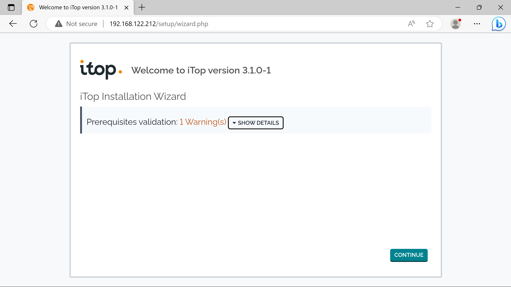
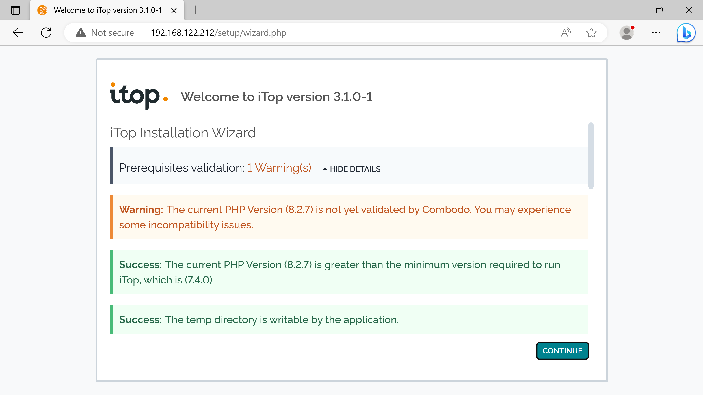
The warning says the used php version (latest) is not tested for this itop version by Combodo. *(not appening with debian 11 because its repositories has an older php version)*

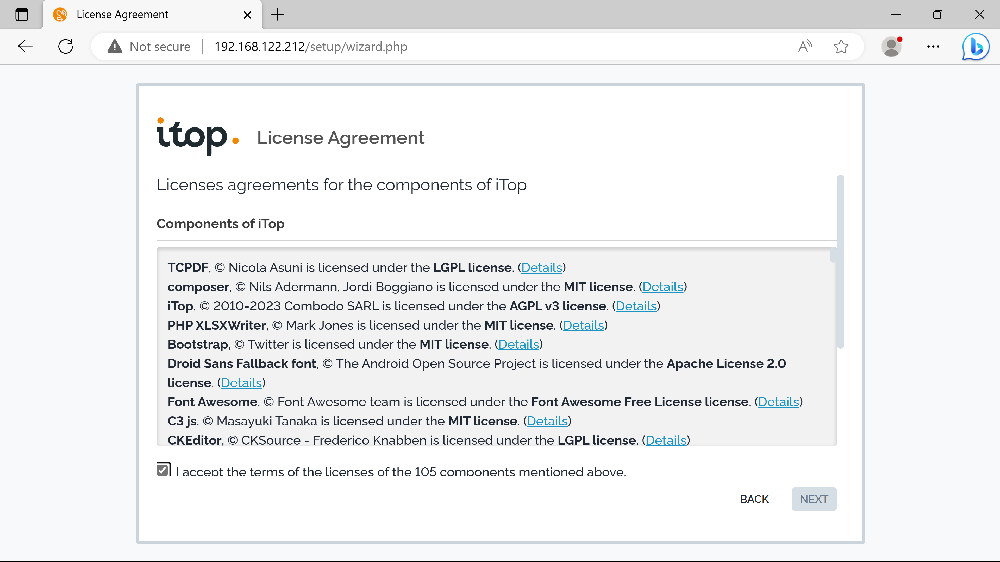
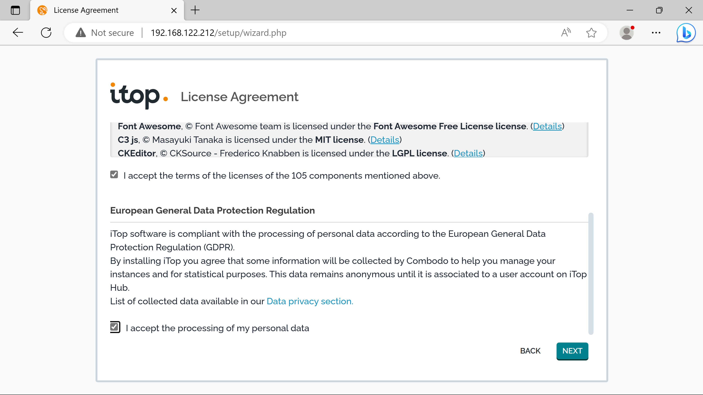

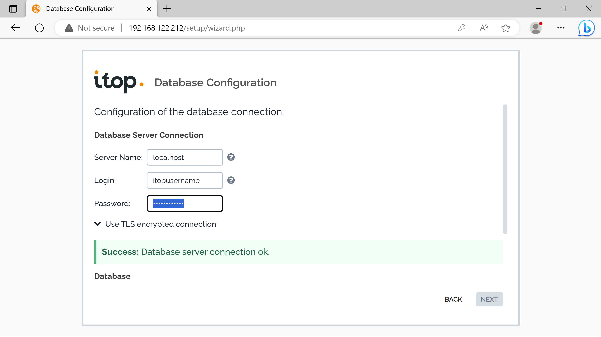
The `Server Name` is *localhost* because the itop instance  & the mysql server are on the same host *- can be replaced by the ip address of the external mysql server if using the seperate solution*.

The `Login` & the `Password` was created during the `debian-mysql-install.sh` script process *- asked at the beginning -*.

The database name found was also created during the installation process.
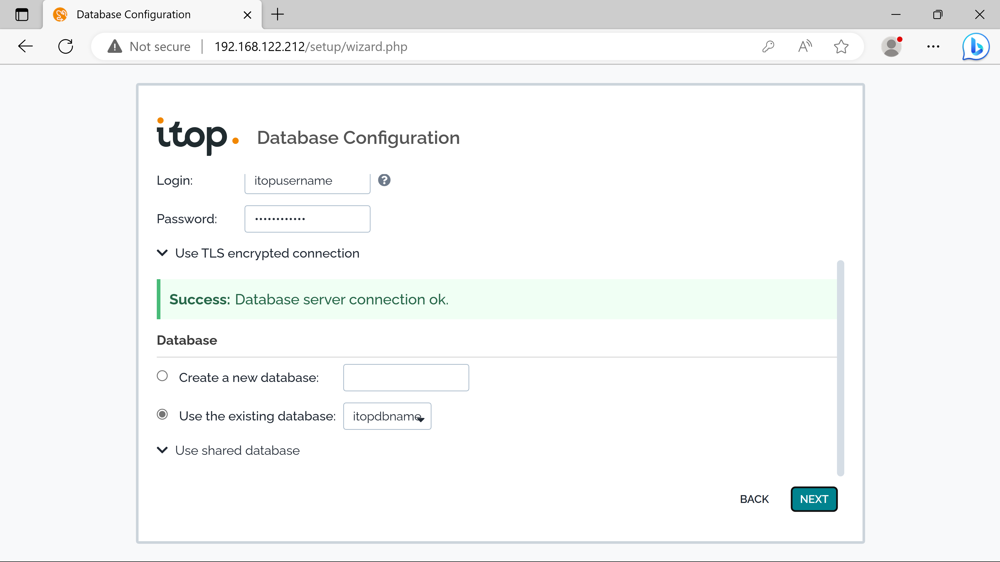
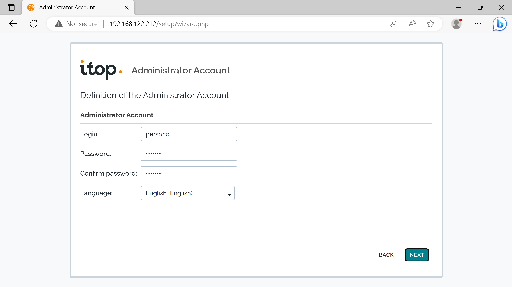
`Person C` will have admin privilieges for this itop instance, since it is the `Technical Manager`. (*can add more admins after*)

The `Language` set is for this user only.
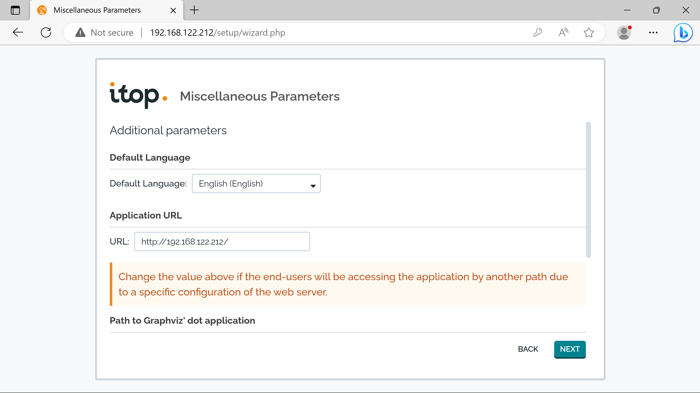
Here the `Default Language` for all users can be changed. Can also be changed by individual users after deploying.

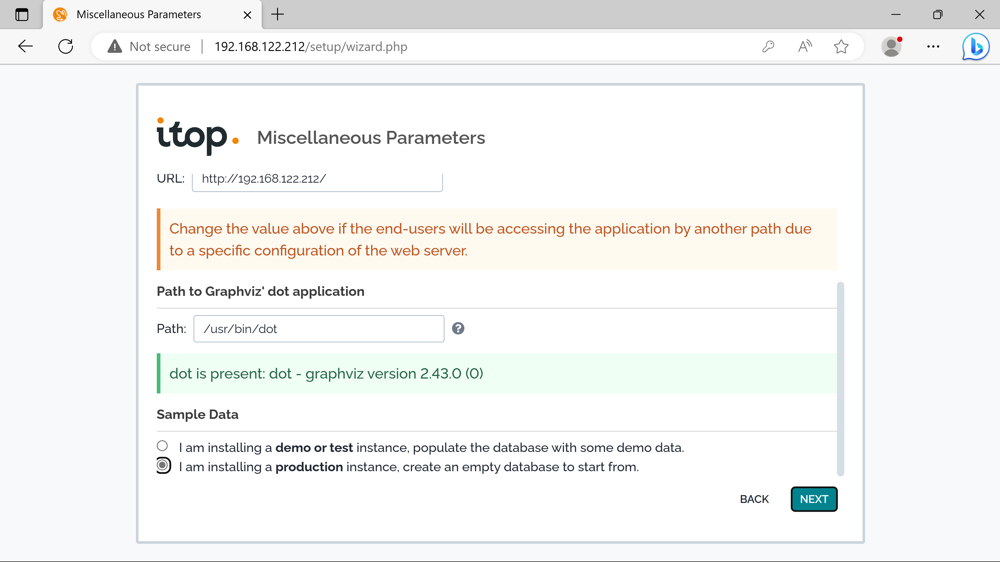

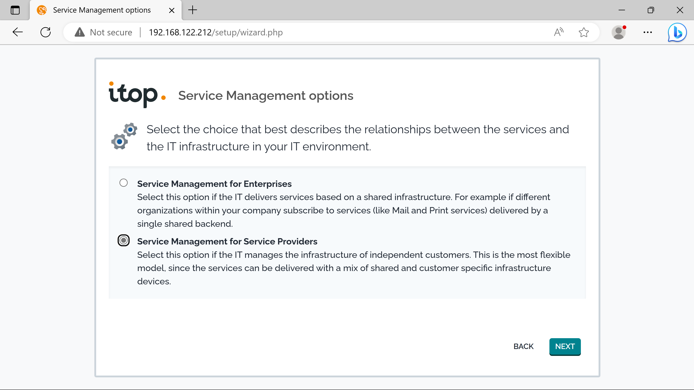
Since the `Company A` acts as a service provider, the second option is chose. The first option should be kept if delivering IT services to company departements.

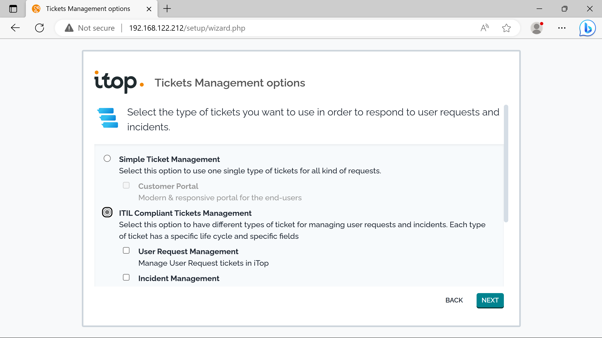
Simple Ticket Management can be chose to get rid of `SLTs` & `SLAs`.

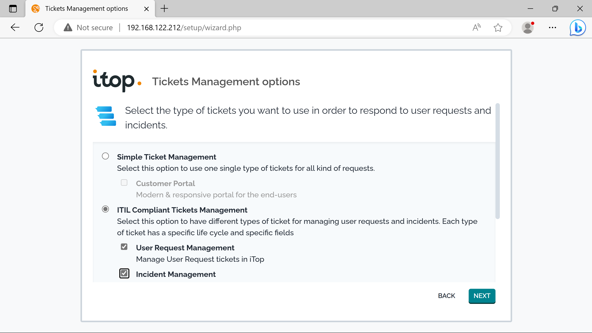

The Customer Portal is the itop interface but reagenced for users tickets. If not chose, tickets should be created using command-lines method or the rest api.
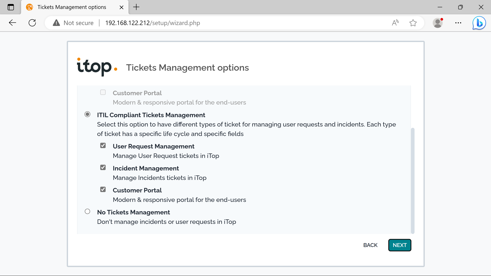

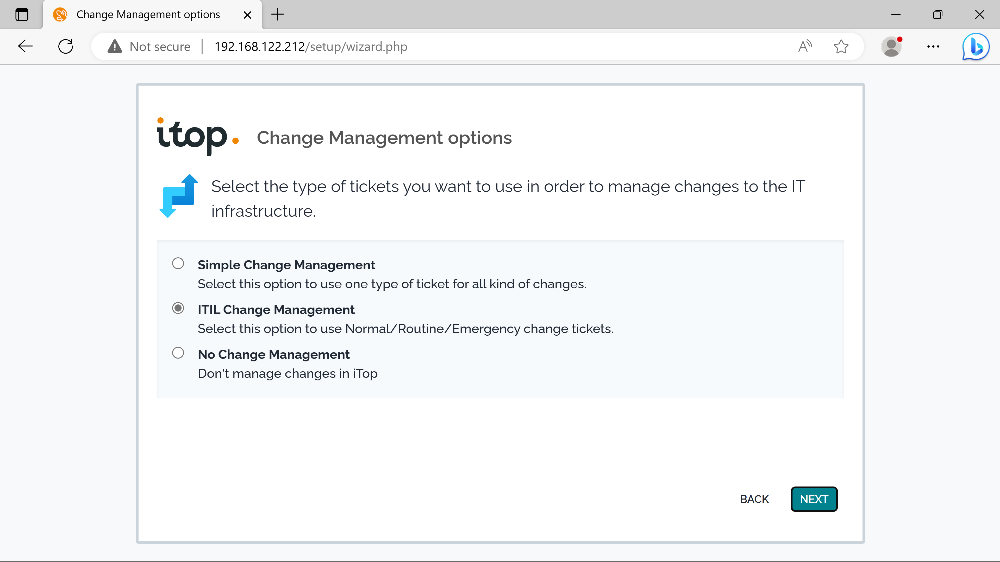


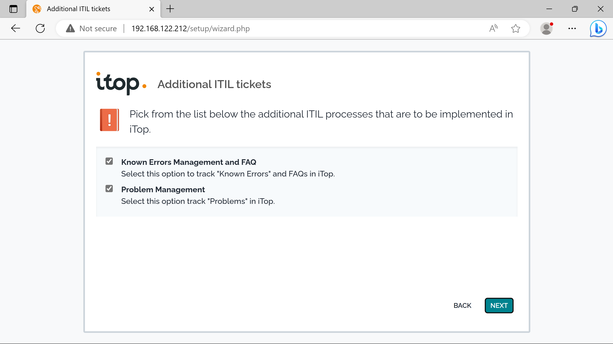


### cmdb confirguration

The cmdb (organizations, persons, teams etc.) needs to be configured first.  

Depending on the company/ies & the infrastructure/s sizes, it could take some time to populate.

Exporting & importing csv files is a great option to configure it quickly. Here is a [video from itop](https://youtu.be/od1oYY5zEoA) explaining how to do so (*i still think putting mine will be worse*).

Synchronizing csv files (itop server & an editor side) can also be done to avoid entering each modification manually, scheduling this task to. ELDAP & AD services can also be used instead of this method.

Manual objects implementation & modification can also be done. A rest api is also present for external use cases.

### itsm overview

The itsm is following the cmdb configuration: users created, teams, organizations, services, contracts etc. 

`External User` profile for the `iTop User` object have a dashboard to create requests according to purchased services.


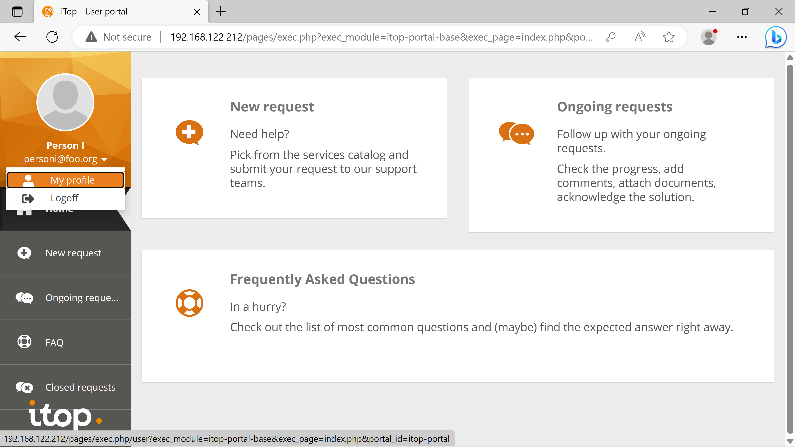
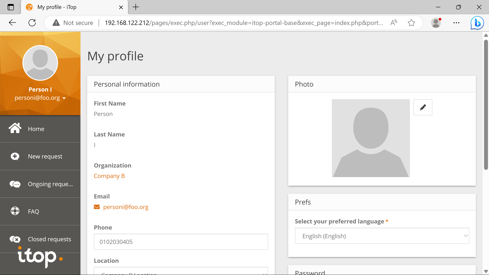

The user can change his `Phone` number, `Location` according to his company's locations in the cmdb, the language to use or his profile picture.

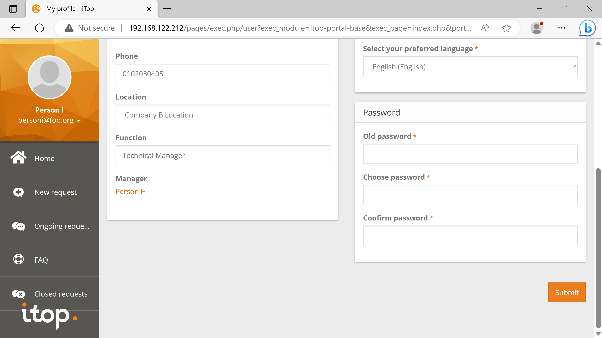

It can also rename his function inside the company or change his password.

When entering in `New request`, according to [default objects](#default-objects), the services can be defined in sub-services to help the end user.

The provider has the itop dashboard (administrators like person c or other profiles) to interract with created tickets.

To avoid putting a gigantic amount of screenshots to show how the itsm works, [here is itop video](https://www.youtube.com/watch?v=aCHqQGPdNEk) for that (better than the ones i made i think...). 

A [designer](https://www.combodo.com/itsm-designer-195) is available to custom the itsm interfaces.

### monitoring

Once the [cmdb is configured](#confirguration), links can be done between hardware & `Application Services` for the end users.

They are created using `Contracts` (Customer & Provider) with `SLAs` etc.

Since itop is an itsm & cmdb solution, it doesn't have a proper monitoring system.

However, itop can integrate nagios for incident management (creating tickets).

## close

It required a lot of time & effort to make my hands on, it's not incredibly difficult *- depends on what you usually do -* but demanding. (compare to the nagios experience i have)

To keep their customers' time, they do [bootcamps](https://www.combodo.com/itop-cmdb-online-training-april-4-5) for 140$/h & have paid consultants.

For a production or business use, customers may pay for the professional or business itop solutions with consultants to help them integrating itop & keep a lot of time.

I think one or more IT guys are needed to implement, maintain & using it (expecially with oql querries & various technos not covered).

I saw on forums itop could implement customers' itsm for their need, but the discussion stopped here.

I also like their [blog](https://blog.combodo.com/en).

I am happy that i have found a way to understand itop & the surroundings properly & alone in a week, i hope so.