
understanding Nagios principles  
& deploying it using custom scripts


## introduction
For my work-study, i immersed myself in understanding Nagios for a week.

Here i expose what i've learned & what i've done with it.

I'd be extremely grateful if you'd consider correcting me if i said something wrong.

This article mainly talk about Nagios as the Nagios Core solution.

### presentation
[Nagios Core](https://www.nagios.org/projects/nagios-core/) is a open source, widely used monitoring tool for hosts, applications & services.

The company behind Nagios, [Nagios Enterprises](https://www.nagios.com/about-nagios-enterprises/), afford to make Nagios Core free & open source by their financing policy.

They provide non-free solutions to make the Nagios Core utilisation simplified, such as a native & more sophisticated dashboard - [Nagios XI](https://www.nagios.com/products/nagios-xi/), or a better network implementation - [Nagios Network Analyzer](https://www.nagios.com/products/nagios-network-analyzer/).

These solutions are improvers for Nagios Core, highly prefered for production use but not essential to use Nagios Core.

### side notes

Nagios Core code can be found on [Github](https://github.com/NagiosEnterprises/nagioscore), it is mostly written in C language.

I found the [documentation](https://www.nagios.org/documentation/) quite well explained (using and compiling Nagios from source code) although sometimes confusing, obsolete or "oldish".

You may also consider, regarding your deontology or your use cases, collecting your own metrics for your hosts to serve them into a dashboard - using Prometheus & Grafana for known examples.

## nagios principles

I will cover the basics of Nagios Core according to monitoring windows & linux hosts with their services.

### fundamentals
Nagios Core need to be installed on a host, bare metal or in a vm - no official docker image available.

To monitor hosts, the Nagios server will execute a sequence of commands at a sheduled time interval & will define the state of the monitored host/service according to the output of the command.

This series of tests can be customise according to what service you want to monitor on which host.

A simple & in use example can be the `HOST STATUS` check by Nagios: the Nagios server send an echo request to the host - ping command. If it receive an echo reply -> `HOST STATUS: ONLINE`, else -> `HOST STATUS: OFFLINE`.

In addition to well-known protocols, to monitor the largest amount of services, Nagios let its community post their own `Projects`.  
Since then, the community created & shared their free [plugins](#plugins) & [add-ons](#add-ons) to monitor their needed services on Nagios - all in their [Nagios Exchange](https://exchange.nagios.org/) platform.

### plugins

The commands used to monitor services are called `plugins`.

Plugins are located in `/usr/local/nagios/libexec/` with their name starting with `check_*`.

These plugins can be used as executable files to quickly check the status of services (very usefull during pre-production tests for my part).

Here is an example how to use the `check_http` plugin.

```sh
/usr/local/nagios/libexec/check_http -h
```
> displaying the help page  
> for the check_http plugin

Following to the `check_http` help page, we can execute the command on a host.

<!-- /usr/local/nagios/libexec/check_tcp -H 192.168.122.15 -p 80 -->

```sh
/usr/local/nagios/libexec/check_http -H 192.168.122.15
```
> HTTP OK: HTTP/1.1 200 OK - 10975 bytes in 0.002 second response time |time=0.001620s;;;0.000000 size=10975B;;;0

### add-ons

Plugins only check external metrics about hosts. To monitor internal ones like system utilisation (ram, cpu, disk..), Nagios use what they call `add-ons`.

Add-ons are software installed on hosts that make the Nagios server capable of gathering internal or restricted metrics.

Biggest add-ons are maintain by the community of Nagios users to keep gathering their services as they need to.

From the Nagios server side, the add-ons will be used as executable files like plugins are.

### nagios configuration files

Nagios configuration files `*.cfg` are located in `/usr/local/nagios/etc/`.

```
.
├── cgi.cfg
├── htpasswd.users
├── nagios.cfg
├── ressource.cfg
└── objects
   ├── commands.cfg
   ├── contacts.cfg
   ├── localhost.cfg
   ├── printer.cfg
   ├── switch.cfg
   ├── templates.cfg
   ├── timeperiodes.cfg
   └── windows.cfg
```

Since they are well documented inside & on the web, i'll just outline their purpose.

The `nagios.cfg` is the main Nagios configuration file. It contains informations like the log files location - can be changed, hosts directories location or services update interval.

A standard `htpasswd.users` is created in the installation process & define the Nagios users passwords.

CGIs check their `cgi.cfg` configuration file to gather user & groups rights & permission. It also contains the path for Nagios frontend files.

`ressource.cfg` define macros used in hosts configuration files for sensitive informations. Also provide plugins paths - handy for moving plugins or adding custom ones.

*(example of "sensitive informations": to monitor non public metrics about a database, you might need to log into using a username & a password at some point)*

The configuration files inside the `objects` directory are used to define commands, contacts, hosts, services etc. (more on that in [hosts configuration files](#hosts-configuration-files))

### hosts configuration files

Nagios monitor hosts by scheduling [plugins](#plugins) tasks or calling [add-ons](#add-ons) and reporting the results on a control panel.

To define what checks should be made on which host, Nagios use `Object Configuration Files`. 

These are `*.cfg` configuration files in which you define the host informations to monitor & the `check_` commands should be used.

It is recommended to create directories to manage your kinds of hosts - create a folder with all the `*.cfg` files for windows clients, linux servers etc.

## deployment
Here i demonstrate what i said in [how nagios works](#how-nagios-works).

Deploying an infrastructure based on the system monitoring of a `Windows Host` (server or client) & a `Debian Host`.  
The `Nagios Server` will also monitor a mysql server & an apache website hosted on the Debian Host.

### network plan
```goat
                               +-------------------------+
                               |                         |
                               |     Network Switch      |
                               |                         |
                               +----------+-+-+----------+
             +----------------------------+ + +---------------------------+
             |                              |                             |
             | .---------------.            | .--------------.            | .---------------.
             || 192.168.122.203 |           || 192.168.122.53 |           || 192.168.122.165 |
             | '---------------'            | '--------------'            | '---------------'
+------------+------------+   +-------------+-----------+    +------------+------------+
|                         |   |                         |    |                         |
|      Nagios Server      |   |       Windows Host      |    |       Debian Host       |
|                         |   |                         |    |                         |
+-------------------------+   +-------------------------+    +-------------------------+
```

### windows host

[Add-ons](#add-ons) are needed to monitor hosts system activity.

[NSClient++](https://nsclient.org/) will be the add-on used for the windows host.

The nsclient++ agent need to be installed on the host & the nagios server will be configured to call the agent to gather system metrics.

The add-on installation is the same for windows 10 & 11.

To start, you need to download & execute the agent installer on the host.


Download the latest nsclient++ agent installer


The agent will only accept metrics gathering from `allowed_hosts`.

By default the only allowed host is the host himself `127.0.0.1` but the agent installer will ask you to enter new/an another one: the nagios server ip address.

To prevent ip spoofing for example, a password will be asked to ensure the nagios server authenticity: only the host & the nagios server should know this password.

The port used for the communication between them is `12489`.

Before installing, the agent will prompt you to run the installation process as administrator.

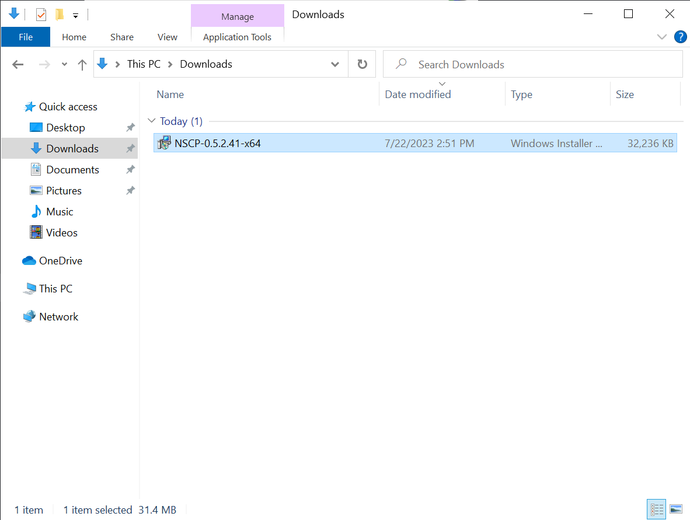

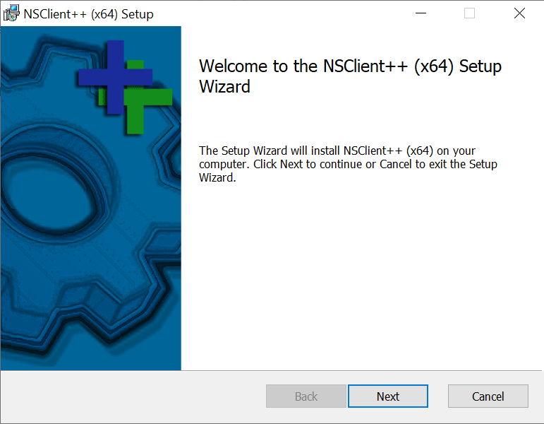

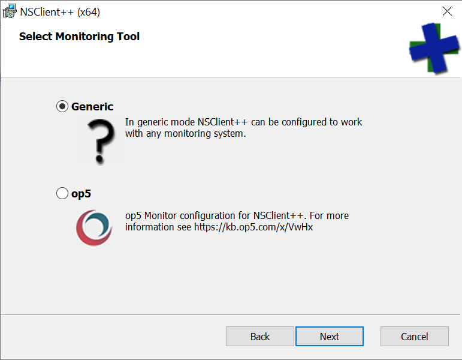

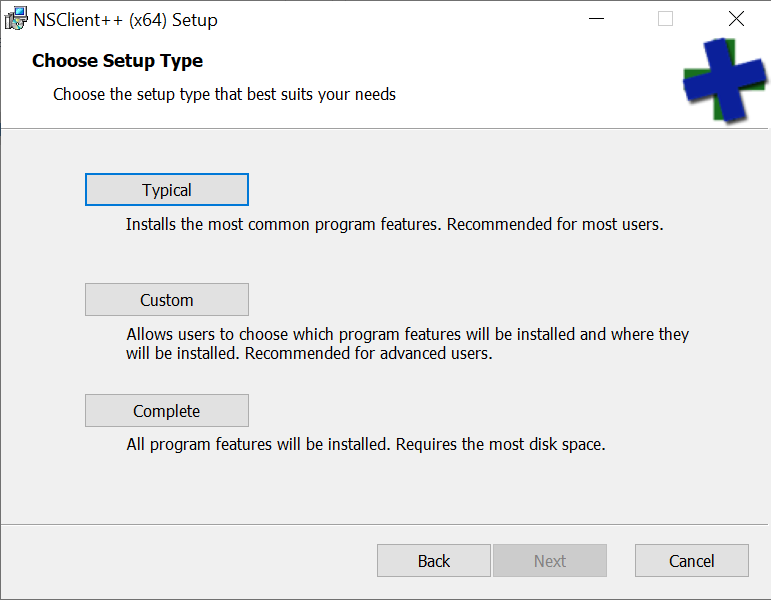

> You can choose the Complete Setup Type for more metrics, the Configuration panel will be the same - tested.


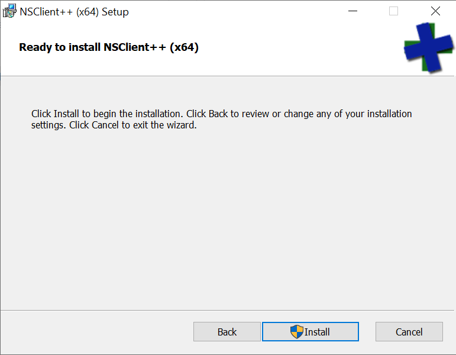

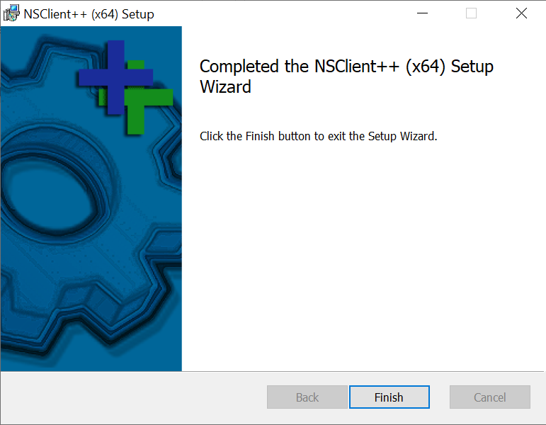

### linux host

As well as for the [windows host](#windows-configuration), the debian one will have an add-on agent: [NRPE](https://exchange.nagios.org/directory/Addons/Monitoring-Agents/NRPE--2D-Nagios-Remote-Plugin-Executor/details).

I made an install script for nrpe agent on debian hosts by compiling it from source, source code is on [Github](https://github.com/xeylou/nagios-introduction) - tested on debian 11 & 12.

```sh
wget https://github.com/xeylou/nagios-introduction/debian-nrpe-install.sh
chmod +x debian-nrpe-install.sh
./debian-nrpe-install.sh
```

NRPE agent accept to transfer metrics to the `allowed_hosts`. Configuring those is made in the `/etc/nrpe.d/nrpe.cfg` by modyfying the variable value.

Using my script, you will be asked for the ip address of the nagios server & it will change that in the file according to what you entered.

The port `5666` will be used to transfer metrics.

### nagios server

The Nagios Server is in my case a Debian machine. The debian will host Nagios Core & the Nagios Plugins.

I made a script for their installation on my [Github](https://github.com/xeylou/nagios-introduction) - also tested on debian 11 & 12.

```sh
wget https://github.com/xeylou/nagios-introduction/debian-nagios-install.sh
chmod +x debian-nagios-install.sh
./debian-nagios-install.sh
```

Once installed, the Nagios web interface can be reach at `http://192.168.122.203/nagios` with the username `nagiosadmin` & the password given at the start of the installation.

We can now check the connectivity with the hosts.

```
/usr/local/nagios/libexec/check_nrpe -H 192.168.122.165
```
> NRPE v4.1.0

```sh
/usr/local/nagios/libexec/check_nrpe -H 192.168.122.53
```

> CHECK_NRPE: (ssl_err != 5) Error - Could not complete SSL handshake with 192.168.122.53: 1

I interpret it as a "good" error because it can reach the host without using the password, instead of.

> CHECK_NRPE STATE CRITICAL: Socket timeout after 10 seconds.

Time to create their `*.cfg` configuration files.

Creating two directories: `windows-hosts` & `debian-hosts`.

```sh
mkdir /usr/local/nagios/etc/windows-hosts
mkdir /usr/local/nagios/etc/debian-hosts
```

Added them to the `/usr/local/nagios/etc/nagios.cfg` nagios configuration file.

```sh {linenos=table, hl_lines=["5-6"], linenostart=47}
# You can also tell Nagios to process all config files (with a .cfg
# extension) in a particular directory by using the cfg_dir
# directive as shown below:

cfg_dir=/usr/local/nagios/etc/windows-hosts
cfg_dir=/usr/local/nagios/etc/debian-hosts
#cfg_dir=/usr/local/nagios/etc/servers
#cfg_dir=/usr/local/nagios/etc/printers
#cfg_dir=/usr/local/nagios/etc/switches
#cfg_dir=/usr/local/nagios/etc/routers
```

For the windows host, a template in `/usr/local/nagios/etc/objects/windows.cfg` is here to monitor standard services for windows hosts. Used it to create the `windows-host.cfg` windows configuration file.

```sh
cp /usr/local/nagios/etc/objects/windows.cfg /usr/local/nagios/etc/windows-hosts/windows-host.cfg
```

In the new `/usr/local/nagios/etc/windows-hosts/windows-host.cfg`, i changed the template values.

```sh {linenos=inline, hl_lines=["4-6"], linenostart=21}
define host {

    use                     windows-server        ; Inherit default values from a template
    host_name               windows-host        ; The name we're giving to this host
    alias                   Windows Host        ; A longer name associated with the host
    address                 192.168.122.53      ; IP address of the host
}
```

Also replaced the `host_name` in the services, here one example.

```sh {linenos=table, hl_lines=["4"], linenostart=57}
define service {

    use                     generic-service
    host_name               windows-host
    service_description     NSClient++ Version
    check_command           check_nt!CLIENTVERSION
}
```

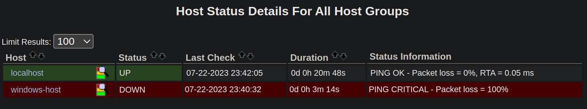

Since windows block entering echo request, to make the `HOST STATUS` up, you will need to accept them in the ingress firewall settings.

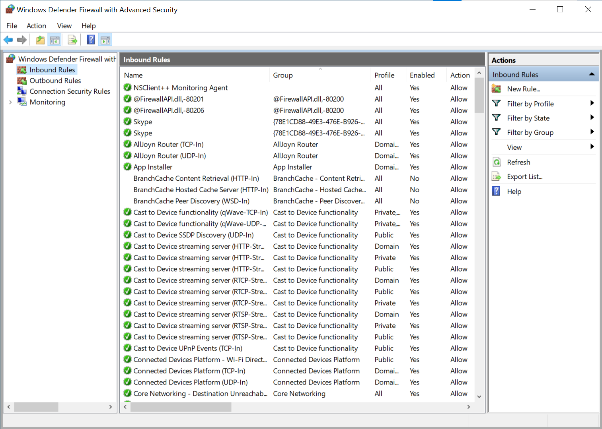
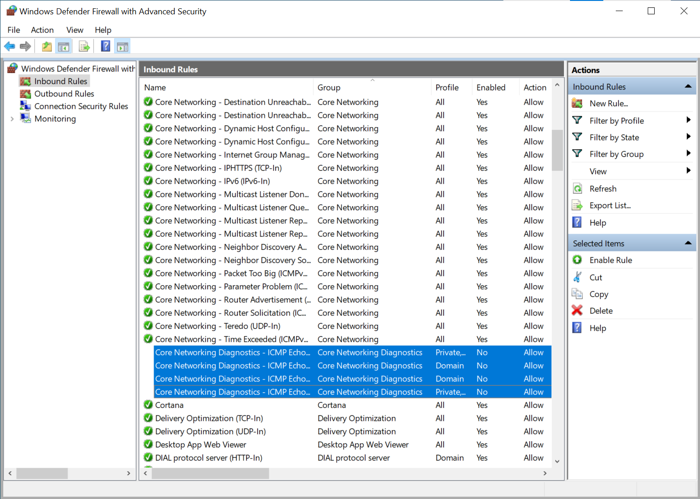
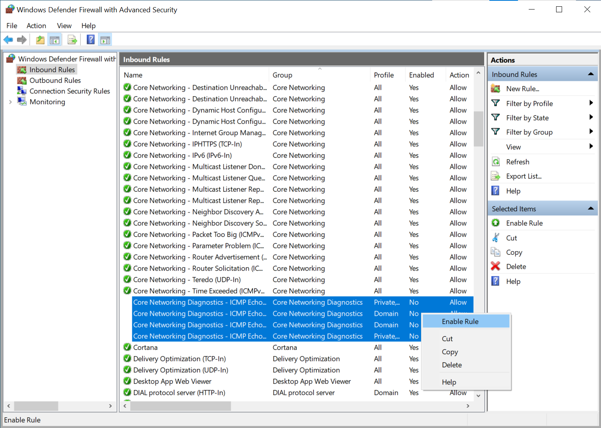
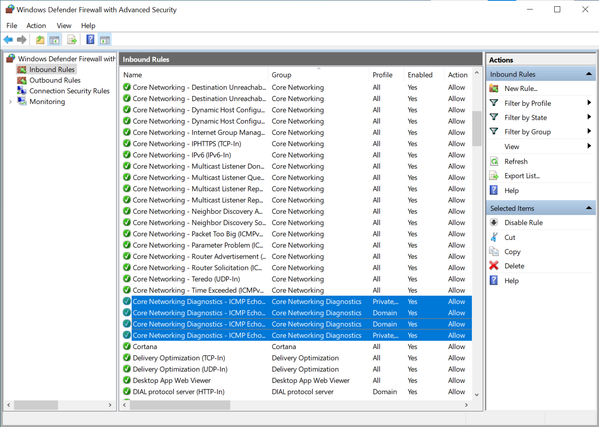
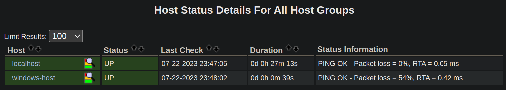

Seeing the host services, Nagios show up that we didn't entered the asked password.


The password need to be prompted in the `/usr/local/nagios/etc/objects/commands.cfg` command configuration file that nagios execute.

```sh {linenos=inline, hl_lines=["4"], linenostart=222}
define command {

    command_name    check_nt
    command_line    $USER1$/check_nt -H $HOSTADDRESS$ -p 12489 -s thisisthepassword -v $ARG1$ $ARG2$
}
```


<!-- 


```sh
cp /usr/local/nagios/etc/objects/windows.cfg /usr/local/nagios/etc/windows-hosts/windows-host.cfg
```

In the new `/usr/local/nagios/etc/windows-hosts/windows-host.cfg` file, i changed the template values.

```sh {linenos=table, hl_lines=["3-6"], linenostart=21}
define host {

    use                     windows-host
    host_name               windows-host
    alias                   Windows Host
    address                 192.168.122.53
}
```

Also replaced the `host_name` in the services, here one example.

```sh {linenos=table, hl_lines=["4"], linenostart=57}
define service {

    use                     generic-service
    host_name               windows-host
    service_description     NSClient++ Version
    check_command           check_nt!CLIENTVERSION
}
```

The debian host configuration file 

 -->


<!-- Added them to the `/usr/local/nagios/etc/nagios.cfg` nagios configuration file.

```sh {linenos=table, hl_lines=["4-8"], linenostart=34}
# Definitions for monitoring the local (Linux) host
cfg_file=/usr/local/nagios/etc/objects/localhost.cfg

# Definitions for monitoring the Windows Host
cfg_file=/usr/local/nagios/etc/objects/windows-host.cfg

# Definitions for monitoring the Debian Host
cfg_file=/usr/local/nagios/etc/objects/debian_host.cfg
``` -->


### overview
***companie orientée profit mais code open source car communauté travail pour elle entre guillement, s'ils ferment le code il ya plus rien, ils perdent l'étendu du monitoringde service (car licences gpl)***
***tellement vieux***
***le code bouge plus trop, prendre exemple release date des add-on ou de nagios et dire que je les ai pris dans l'install ici pour fini***
I keep in mind that Nagios Enterprise is a profit oriented company. Even if they seem to like the idea of keeping Nagios Core open-source, i cannot tell they will not [close their source for competiting or profit reason someday](https://www.redhat.com/en/blog/furthering-evolution-centos-stream).
## opinion