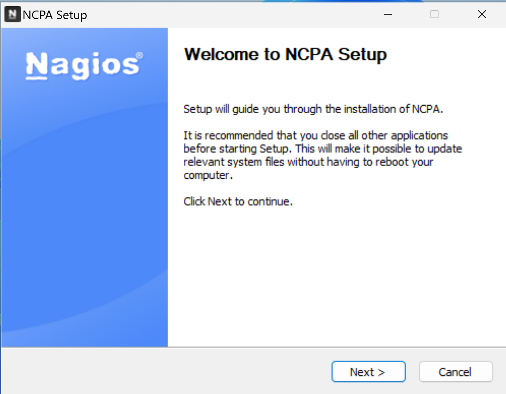
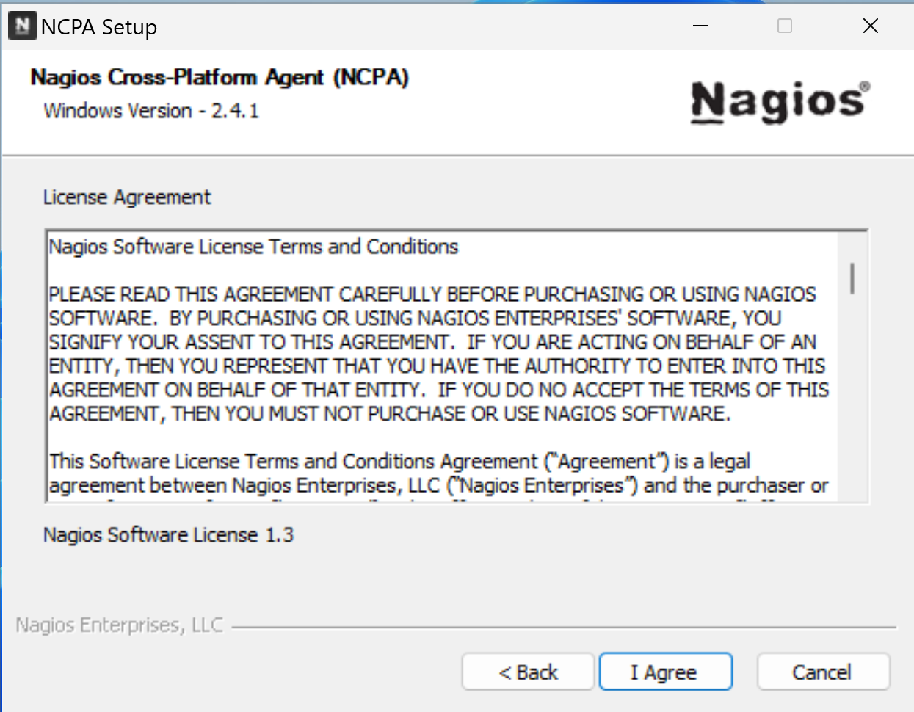
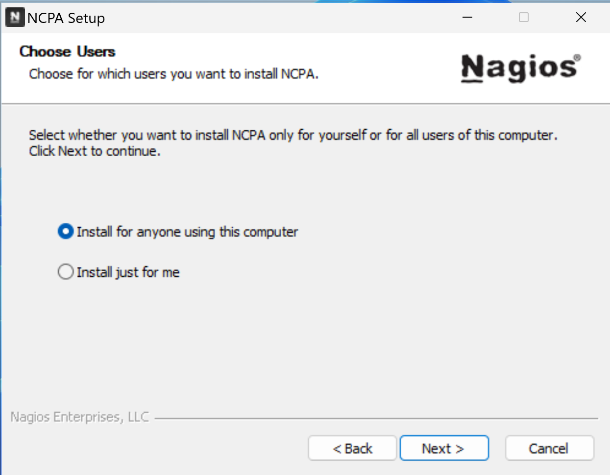


understanding Nagios principles & deploying  
a monitoring infrastructure using custom scripts


## introduction
For my work-study, i immersed myself in understanding Nagios for a week.

Here i expose what i've learned & what i've done with it.

I'd be extremely grateful if you'd consider correcting me if i said something wrong.

This article mainly talks about Nagios as the Nagios Core solution.

### presentation
[Nagios Core](https://www.nagios.org/projects/nagios-core/) is a open source, widely used monitoring tool for hosts, applications & services.

The company behind Nagios, [Nagios Enterprises](https://www.nagios.com/about-nagios-enterprises/), afford to make Nagios Core free & open source by their financing policy.

They provide non-free solutions to make the Nagios Core utilisation simplified, such as a more sophisticated dashboard - [Nagios XI](https://www.nagios.com/products/nagios-xi/), or a better network implementation - [Nagios Network Analyzer](https://www.nagios.com/products/nagios-network-analyzer/).

Those solutions are improvers for Nagios Core, highly prefered for production use but not essential to use Nagios Core.

### side notes

Nagios Core code can be found on [Github](https://github.com/NagiosEnterprises/nagioscore), it is mostly written in C language.

I found the [documentation](https://www.nagios.org/documentation/) quite well explained (using and compiling Nagios from source) although sometimes confusing, obsolete or "oldish".

You may also consider, regarding your deontology or your use case, using your own metrics collector to serve them into a dashboard - using Prometheus & Grafana for examples.

## nagios principles

I will cover the basics of Nagios Core according to monitoring windows & linux hosts with their services.

### fundamentals
Nagios Core need to be installed on a host, bare metal or in a vm - no official docker image available.

To monitor hosts, the Nagios server will execute a sequence of commands at a sheduled interval & will define the state of the monitored host/service according to the output of the commands.

This series of tests can be customise according to what service you want to monitor.

A simple & in use example can be the default `HOST STATUS` check by Nagios: the Nagios server send an echo request to the host - ping command. If it receive an echo reply back -> `HOST STATUS: UP`, else -> `HOST STATUS: DOWN`.

Apart from well-known protocols, to monitor the largest amount of services, Nagios lets its community post their own `Projects`.

Since then, the community created & shared their free [plugins](#plugins) & [add-ons](#add-ons) to monitor their needed services on Nagios - all in their [Nagios Exchange](https://exchange.nagios.org/) platform.

### plugins

The commands used to monitor services are called `plugins`.

Plugins are located in `/usr/local/nagios/libexec/` with their name starting with `check_*`.

These plugins can be used as executable files to quickly check the status of services.  
Those actions are parts of "active monitoring", which are usefull during pre-production tests.

Example of an active check with `check_http` plugin.

```bash
/usr/local/nagios/libexec/check_http -h
```
> display the help page  
> for the check_http plugin

Following to the `check_http` help page, this check can be executed on a host to check its http response.

<!-- /usr/local/nagios/libexec/check_tcp -H 192.168.122.15 -p 80 -->

```bash
/usr/local/nagios/libexec/check_http -H 192.168.122.15
```
> HTTP OK: HTTP/1.1 200 OK - 10975 bytes in 0.002 second response time |time=0.001620s;;;0.000000 size=10975B;;;0

### add-ons

Plugins only monitor external host metrics.

To monitor internal ones like system utilisation (cpu load, ram utilisation, disk usage etc.), Nagios use what they call `add-ons`.

Add-ons are splited software, an `agent` part is installed on the monitored host waiting for a gathering query & an executable file is on the nagios server to communicate with the agent api.

Those add-ons often use tokens or passwords to verify the authenticity of the nagios server.

Biggest add-ons are maintain by the community of Nagios users to keep gathering their services as they need to.

From the Nagios server side, the add-ons will be used as executable files like plugins are.

### nagios configuration files

Nagios `*.cfg` configuration files are located in `/usr/local/nagios/etc/`.

```
.
├── cgi.cfg
├── htpasswd.users
├── nagios.cfg
├── ressource.cfg
└── objects
   ├── commands.cfg
   ├── contacts.cfg
   ├── localhost.cfg
   ├── printer.cfg
   ├── switch.cfg
   ├── templates.cfg
   ├── timeperiodes.cfg
   └── windows.cfg
```

Since they are well documented inside & on the web, i'll just outline their purpose.

The `nagios.cfg` is the main Nagios configuration file. It contains informations like the log files location - can be changed, hosts directories location or services update interval.

A standard `htpasswd.users` is created in the installation process & define the Nagios users passwords.

CGIs check their `cgi.cfg` configuration file to gather user & groups rights & permissions. It also contains the path for Nagios frontend files.

`ressource.cfg` define macros used in hosts configuration files for sensitive informations. Also provide plugins paths - handy for moving plugins or adding custom ones.

*(example of "sensitive informations": to monitor non public metrics about a database, you might need at some point to log into using a username & a password)*

The configuration files inside the `objects` directory are used to define commands, contacts, hosts, services etc. (more on that in [hosts configuration files](#hosts-configuration-files))

### hosts configuration files

Nagios monitor hosts by scheduling [plugins](#plugins) tasks or calling [add-ons](#add-ons) and reporting the results on a control panel.

To define what checks should be made on which host, Nagios use `Object Configuration Files`. 

These are `*.cfg` configuration files in which you define the host informations to monitor & the `check_` commands should be used.

It is recommended to create directories to manage your kinds of hosts - create a folder with all the `*.cfg` files for windows clients, linux servers etc.

## deployment
Here i demonstrate what i said in [how nagios works](#how-nagios-works).

Deploying an infrastructure based on the system monitoring of a `Windows Host` (server or client) & a `Debian Host`.

The `Nagios Server` will also monitor a mysql server & an apache website hosted on the Debian Host.

### network plan
```goat
                               +-------------------------+
                               |                         |
                               |     Network Switch      |
                               |                         |
                               +----------+-+-+----------+
             +----------------------------+ + +---------------------------+
             |                              |                             |
             | .---------------.            | .--------------.            | .---------------.
             || 192.168.122.203 |           || 192.168.122.53 |           || 192.168.122.165 |
             | '---------------'            | '--------------'            | '---------------'
+------------+------------+   +-------------+-----------+    +------------+------------+
|                         |   |                         |    |                         |
|      Nagios Server      |   |       Windows Host      |    |       Debian Host       |
|                         |   |                         |    |                         |
+-------------------------+   +-------------------------+    +-------------------------+
```

### windows host

[Add-ons](#add-ons) are needed to monitor hosts system activity.

A lot of agents are available for windows & linux hosts. [Nagios Cross-Platform Agent (NCPA)](https://www.nagios.org/ncpa/) will be used because it is still recently maintained (by Nagios Enterprise).

*(note: for community maintained one, [NSclient++](https://nsclient.org/) for windows & linux seems to be a good choice.)*

To install NCPA, need to start by downloading & executing the agent installer on the host.


Download the latest NCPA agent installer


Here are the simple following steps for the install.





`Bind IP` as a default value of `0.0.0.0` to accept every ip address who request metrics - replaced it by the Nagios Server ip address.

`Port` & `Token` can be changed.





### linux host

Since ncpa is cross-platform, i chose to use it for the debian host too.

I made an install script for the debian agent, source code is on [Github](https://github.com/xeylou/nagios-introduction/debian-ncpa-install.sh).

```bash
mkdir testing && cd testing
wget https://github.com/xeylou/nagios-introduction/debian-ncpa-install.sh
chmod +x debian-ncpa-install.sh
./debian-ncpa-install.sh
```

By using my script, it will ask you the nagios server ip address to change the `allowed_hosts` in `/usr/local/ncpa/etc/ncpa.cfg` as well as the token by modifying `community_string`.

For other linux distributions, the [ncpa download page](https://www.nagios.org/ncpa/#downloads) can be usefull.

The port `5693` is used to transfer metrics.

### nagios server

The Nagios Server is in my case a Debian machine that host Nagios Core & the Nagios Plugins.

I made an install script for those on my [Github](https://github.com/xeylou/nagios-introduction) - tested on debian 11 & 12.

```bash
mkdir testing && cd testing
wget https://github.com/xeylou/nagios-introduction/debian-nagios-install.sh
chmod +x debian-nagios-install.sh
./debian-nagios-install.sh
```

Nagios web interface can be reach at `http://192.168.122.203/nagios` with the username `nagiosadmin` & the password given at the beginning of the installation.

To check the connectivity to the agent hosts.

*(note: the `-H` parameter is the host's hostname or its ip address, `-t` is for the token created by the host during the ncpa installation process, `-P` the used port & `-M` the called value)*

```
/usr/local/nagios/libexec/check_ncpa.py -H 192.168.122.53 -t 'windows-host' -P 5693 -M system/agent_version
```
> OK: Agent_version was ['2.4.1']

```
/usr/local/nagios/libexec/check_ncpa.py -H 192.168.122.165 -t 'debian-host' -P 5693 -M system/agent_version
```
> OK: Agent_version was ['2.4.1']

NCPA is used to monitor the windows & the debian host, the same syntax can be use to monitor both.

Example of active monitoring of the cpu load.

```bash
/usr/local/nagios/libexec/check_ncpa.py -H 192.168.122.53 -t 'windows-host' -P 5693 -M cpu/percent -w 20 -c 40 -q 'aggregate=avg'
```
> OK: Percent was 4.70 % | 'percent'=4.70%;20;40;

Here on the debian host.

```bash
/usr/local/nagios/libexec/check_ncpa.py -H 192.168.122.165 -t 'debian-host' -P 5693 -M cpu/percent -w 20 -c 40 -q 'aggregate=avg'
```
> OK: Percent was 0.00 % | 'percent'=0.00%;20;40;

Refer to the [ncpa documentation](https://www.nagios.org/ncpa/help.php) for other metrics to monitor.

To add the hosts to the nagios web interface and start passively monitoring them: the nagios server requires `.cfg` configuration files.

Starting by creating two directories to organise them: `windows-hosts` & `debian-hosts` (see [host configuration file](#hosts-configuration-files)).

```bash
mkdir /usr/local/nagios/etc/windows-hosts
mkdir /usr/local/nagios/etc/debian-hosts
```
Added them to the `/usr/local/nagios/etc/nagios.cfg` nagios configuration file.

```bash {linenos=table, hl_lines=["5-6"], linenostart=47}
# You can also tell Nagios to process all config files (with a .cfg
# extension) in a particular directory by using the cfg_dir
# directive as shown below:

cfg_dir=/usr/local/nagios/etc/windows-hosts
cfg_dir=/usr/local/nagios/etc/debian-hosts
#cfg_dir=/usr/local/nagios/etc/servers
#cfg_dir=/usr/local/nagios/etc/printers
#cfg_dir=/usr/local/nagios/etc/switches
#cfg_dir=/usr/local/nagios/etc/routers
```

These files should define the host using `define host` and the services to monitor (active checks done every `check_interval`).

Here is an example of the `define host` used for monitoring the debian host.

```bash {linenos=inline, hl_lines=["2-4"]}
define host {
    host_name               debian-host
    address                 192.168.122.165
    check_command           check_ncpa!-t 'debian-host' -P 5693 -M system/agent_version
    max_check_attempts      5
    check_interval          5
    retry_interval          1
    check_period            24x7
    contacts                nagiosadmin
    notification_interval   60
    notification_period     24x7
    notifications_enabled   1
    register                1
}
```

The `host_name` is used for nagios to identify the host. The `check_command` will define the check for the `HOST STATUS`.

Here is an example to implement the cpu load check to the configuration file by defining `service`.

```bash {linenos=inline, hl_lines=[2, 4], linenostart=16}
define service {
    host_name               debian-host
    service_description     CPU Load
    check_command           check_ncpa!-t 'debian-host' -P 5693 -M cpu/percent -w 20 -c 40 -q 'aggregate=avg'
    max_check_attempts      5
    check_interval          5
    retry_interval          1
    check_period            24x7
    notification_interval   60
    notification_period     24x7
    contacts                nagiosadmin
    register                1
}
```

You can verify if nagios find errors in your configuration files. Here an example with the debian host created.

```bash
/usr/local/nagios/bin/nagios -v /usr/local/nagios/etc/debian-hosts/debian-host.cfg
```

Finishing by restarting Nagios to make changes take effect.

```sh
systemctl restart nagios
```

### overview

On the nagios web interface, the hosts are in the `Hosts` section.


The services status are available in the `Services` one.


## opinion

vieux

se tient debout grace à sa commu opensource (companie orientée profit mais code open source car communauté travail pour elle entre guillement, s'ils ferment le code il ya plus rien, ils perdent l'étendu du monitoringde service (car licences gpl))

les documentations, les forums sont pour la majorité très vieux